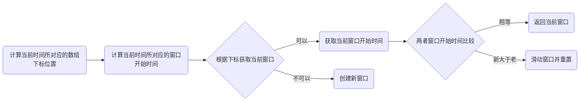

# 1.核心思想

> 1. 定义每个时间窗口长度windowLength=500，定义样本数组大小arrayLength=2
>
> 2. 首先计算当前时间所对应的数组下标位置，计算方式
>
> ​        long time = System.currentTimeMillis();//当前时间
>
> ​        long timeId = time/windowLength;
>
> ​        int idx = (int)(timeId % arrayLength);
>
> 3. 然后计算当前时间所对应的窗口开始时间，计算方式
>
>    long currentWindowStart = time - time % windowLength;

# 2.调用流程



# 3.窗口时间轴变化


>第一次：当前时间戳=49，  索引=0，窗口开始时间=0       =>不存在，创建窗口
>
>第二次：当前时间戳=729，索引=1，窗口开始时间=500  =>不存在，创建窗口
>
>第三次：当前时间戳=1028，索引=0，新窗口开始时间=1000， 根据索引=0 获取原窗口开始时间=0，
>
>​               则新开始时间>原开始时间，需要将原窗口开始时间置为1000，同时将原有值清0
>
>第四次：当前时间戳=1980，索引=1，新窗口开始时间=1500， 根据索引=1 获取原窗口开始时间=500，
>
>​               则新开始时间>原开始时间，需要将原窗口开始时间置为1500，同时将原有值清0

# 4.源码分析

```java
public WindowWrap<T> currentWindow(long time) {
  long timeId = time / windowLengthInMs;
  // 计算当前时间所对应的数组下标位置
  int idx = (int)(timeId % array.length());

  // 计算当前时间所对应的窗口开始时间
  time = time - time % windowLengthInMs;

  while (true) {
    WindowWrap<T> old = array.get(idx);//根据下标获取当前窗口
    if (old == null) {
      WindowWrap<T> window = new WindowWrap<T>(windowLengthInMs, time, newEmptyBucket());
      if (array.compareAndSet(idx, null, window)) {
        return window;
      } else { 
        Thread.yield();
      }
    } else if (time == old.windowStart()) { //相等，直接返回
      return old;
    } else if (time > old.windowStart()) { //新值大于旧值
      ...
        // 滑动窗口并重置
        return resetWindowTo(old, time); //
      ... 
    }
  }
}

@Override
protected WindowWrap<MetricBucket> resetWindowTo(WindowWrap<MetricBucket> w, long startTime) {
  //重置窗口开始时间
  w.resetTo(startTime);
  //清空值
  w.value().reset();
  return w;
}

//重置窗口开始时间
public WindowWrap<T> resetTo(long startTime) {
  this.windowStart = startTime;
  return this;
}

//清空值
public MetricBucket reset() {
  pass.reset();
  block.reset();
  exception.reset();
  rt.reset();
  success.reset();
  initMinRt();
  return this;
}
```

# 5.测试代码

```java
public class WindowLeapArrayTest {

  public static void main(String[] args) throws InterruptedException{
    int windowLength = 500;
    int arrayLength = 2;
    calculate(windowLength,arrayLength);

    Thread.sleep(100);
    calculate(windowLength,arrayLength);

    Thread.sleep(200);
    calculate(windowLength,arrayLength);

    Thread.sleep(200);
    calculate(windowLength,arrayLength);

    Thread.sleep(500);
    calculate(windowLength,arrayLength);

    Thread.sleep(500);
    calculate(windowLength,arrayLength);

    Thread.sleep(500);
    calculate(windowLength,arrayLength);

    Thread.sleep(500);
    calculate(windowLength,arrayLength);

    Thread.sleep(500);
    calculate(windowLength,arrayLength);

  }

  private static void calculate(int windowLength,int arrayLength){
    long time = System.currentTimeMillis();
    long timeId = time/windowLength;
    long currentWindowStart = time - time % windowLength;
    int idx = (int)(timeId % arrayLength);
    System.out.println("time="+time+",currentWindowStart="+currentWindowStart+",timeId="+timeId+",idx="+idx);
  }
}
```