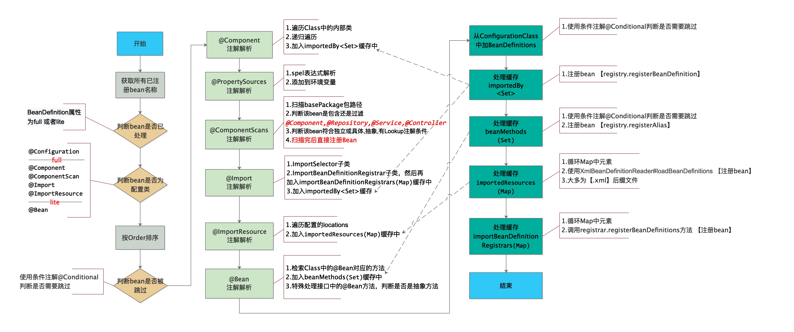
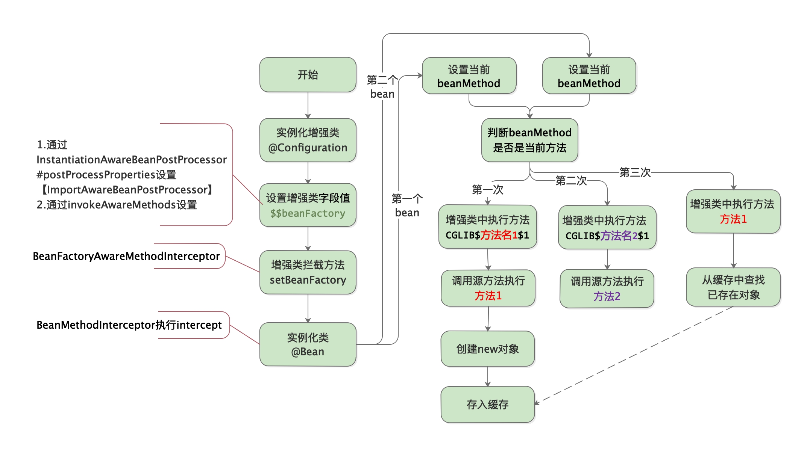

# 1.整体解析流程图



# 2.执行阶段

>AbstractApplicationContext#refresh 
>
>* AbstractApplicationContext#invokeBeanFactoryPostProcessors
>  * PostProcessorRegistrationDelegate#invokeBeanFactoryPostProcessors
>    * PostProcessorRegistrationDelegate#invokeBeanDefinitionRegistryPostProcessors
>      * ConfigurationClassPostProcessor#postProcessBeanDefinitionRegistry

```java
public void processConfigBeanDefinitions(BeanDefinitionRegistry registry) {
  List<BeanDefinitionHolder> configCandidates = new ArrayList<>();
  //获取已经注册的bean名称
  String[] candidateNames = registry.getBeanDefinitionNames();
  for (String beanName : candidateNames) {
    BeanDefinition beanDef = registry.getBeanDefinition(beanName);
    //如果BeanDefinition中的configurationClass 属性为full 或者lite ,则意味着已经处理过了,直接跳过
    if (ConfigurationClassUtils.isFullConfigurationClass(beanDef) ||
        ConfigurationClassUtils.isLiteConfigurationClass(beanDef)) {
    }
    //关键点1
    else if (ConfigurationClassUtils.checkConfigurationClassCandidate(beanDef, this.metadataReaderFactory)) {
      configCandidates.add(new BeanDefinitionHolder(beanDef, beanName));
    }
  }
...
  //@Order值进行排序
  configCandidates.sort((bd1, bd2) -> {
    int i1 = ConfigurationClassUtils.getOrder(bd1.getBeanDefinition());
    int i2 = ConfigurationClassUtils.getOrder(bd2.getBeanDefinition());
    return Integer.compare(i1, i2);
  });
...
  if (this.environment == null) {
    this.environment = new StandardEnvironment();
  }

  //解析每一个 @Configuration 类 ,关键点2
  ConfigurationClassParser parser = new ConfigurationClassParser(
    this.metadataReaderFactory, this.problemReporter, this.environment,
    this.resourceLoader, this.componentScanBeanNameGenerator, registry);
...
  do {
    //进行解析
    parser.parse(candidates);

    Set<ConfigurationClass> configClasses = new LinkedHashSet<>(parser.getConfigurationClasses());
    configClasses.removeAll(alreadyParsed);

    // Read the model and create bean definitions based on its content
    if (this.reader == null) {
      this.reader = new ConfigurationClassBeanDefinitionReader(
        registry, this.sourceExtractor, this.resourceLoader, this.environment,
        this.importBeanNameGenerator, parser.getImportRegistry());
    }
    this.reader.loadBeanDefinitions(configClasses);
...
  }
  while (!candidates.isEmpty());
```

**关键点1：ConfigurationClassUtils类**

```java
static {
  candidateIndicators.add(Component.class.getName());
  candidateIndicators.add(ComponentScan.class.getName());
  candidateIndicators.add(Import.class.getName());
  candidateIndicators.add(ImportResource.class.getName());
}

public static boolean checkConfigurationClassCandidate(
			BeanDefinition beanDef, MetadataReaderFactory metadataReaderFactory) {
...
  if (isFullConfigurationCandidate(metadata)) {
    beanDef.setAttribute(CONFIGURATION_CLASS_ATTRIBUTE, CONFIGURATION_CLASS_FULL);
  }
  else if (isLiteConfigurationCandidate(metadata)) {
    beanDef.setAttribute(CONFIGURATION_CLASS_ATTRIBUTE, CONFIGURATION_CLASS_LITE);
  }
  else {
    return false;
  }

  //排序
  Integer order = getOrder(metadata);
  if (order != null) {
    beanDef.setAttribute(ORDER_ATTRIBUTE, order);
  }

  return true;
}

//full 类判断
public static boolean isFullConfigurationCandidate(AnnotationMetadata metadata) {
  return metadata.isAnnotated(Configuration.class.getName());
}
//lite 类判断
public static boolean isLiteConfigurationCandidate(AnnotationMetadata metadata) {
  // Any of the typical annotations found?
  for (String indicator : candidateIndicators) {
    if (metadata.isAnnotated(indicator)) {
      return true;
    }
  }

  // Finally, let's look for @Bean methods...
  try {
    return metadata.hasAnnotatedMethods(Bean.class.getName());
  }
}
//full 或者 lite 类判断
public static boolean isConfigurationCandidate(AnnotationMetadata metadata) {
	return (isFullConfigurationCandidate(metadata) || isLiteConfigurationCandidate(metadata));
}
```

# 3.ConfigurationClassParser注解解析

>
>
>解析顺序
>
>1. @Component.class
>
>2. @PropertySources.class
>
>3. @ComponentScans.class
>4. @Import.class
>5. @ImportResource.class
>6. @Bean

```java
protected final SourceClass doProcessConfigurationClass(ConfigurationClass configClass, SourceClass sourceClass)
			throws IOException {
  //1.解析@Component
  if (configClass.getMetadata().isAnnotated(Component.class.getName())) {
    processMemberClasses(configClass, sourceClass);
  }

  //2.解析@PropertySources
  for (AnnotationAttributes propertySource : AnnotationConfigUtils.attributesForRepeatable(
    sourceClass.getMetadata(), PropertySources.class,
    org.springframework.context.annotation.PropertySource.class)) {
    if (this.environment instanceof ConfigurableEnvironment) {
      processPropertySource(propertySource);
    }
  }

  //3.解析@ComponentScan
  Set<AnnotationAttributes> componentScans = AnnotationConfigUtils.attributesForRepeatable(
    sourceClass.getMetadata(), ComponentScans.class, ComponentScan.class);
  if (!componentScans.isEmpty() &&
      !this.conditionEvaluator.shouldSkip(sourceClass.getMetadata(), ConfigurationPhase.REGISTER_BEAN)) {
    for (AnnotationAttributes componentScan : componentScans) {
      // The config class is annotated with @ComponentScan -> perform the scan immediately
      Set<BeanDefinitionHolder> scannedBeanDefinitions =
        this.componentScanParser.parse(componentScan, sourceClass.getMetadata().getClassName());
      // Check the set of scanned definitions for any further config classes and parse recursively if needed
      for (BeanDefinitionHolder holder : scannedBeanDefinitions) {
        BeanDefinition bdCand = holder.getBeanDefinition().getOriginatingBeanDefinition();
        if (bdCand == null) {
          bdCand = holder.getBeanDefinition();
        }
        if (ConfigurationClassUtils.checkConfigurationClassCandidate(bdCand, this.metadataReaderFactory)) {
          parse(bdCand.getBeanClassName(), holder.getBeanName());
        }
      }
    }
  }

  //4.解析@Import
  processImports(configClass, sourceClass, getImports(sourceClass), true);

  //5.@ImportResource
  AnnotationAttributes importResource =
    AnnotationConfigUtils.attributesFor(sourceClass.getMetadata(), ImportResource.class);
  if (importResource != null) {
    String[] resources = importResource.getStringArray("locations");
    Class<? extends BeanDefinitionReader> readerClass = importResource.getClass("reader");
    for (String resource : resources) {
      String resolvedResource = this.environment.resolveRequiredPlaceholders(resource);
      configClass.addImportedResource(resolvedResource, readerClass);
    }
  }

  //6.解析@Bean methods
  Set<MethodMetadata> beanMethods = retrieveBeanMethodMetadata(sourceClass);
  for (MethodMetadata methodMetadata : beanMethods) {
    configClass.addBeanMethod(new BeanMethod(methodMetadata, configClass));
  }
  
  //如果有父类的话,则返回父类进行进一步的解析
  if (sourceClass.getMetadata().hasSuperClass()) {
    String superclass = sourceClass.getMetadata().getSuperClassName();
    if (!superclass.startsWith("java") && !this.knownSuperclasses.containsKey(superclass)) {
      this.knownSuperclasses.put(superclass, configClass);
      // Superclass found, return its annotation metadata and recurse
      return sourceClass.getSuperClass();
    }
  }
  return null;
}
```

# 4.@Configuration增强生成代理对象

## 4.1.执行流程图



## 4.2.执行阶段

>AbstractApplicationContext#refresh
>
>* AbstractApplicationContext#invokeBeanFactoryPostProcessors
>  * PostProcessorRegistrationDelegate#invokeBeanFactoryPostProcessors
>    * PostProcessorRegistrationDelegate#invokeBeanFactoryPostProcessors
>      * ConfigurationClassPostProcessor#postProcessBeanFactory

```java
public void enhanceConfigurationClasses(ConfigurableListableBeanFactory beanFactory) {
  Map<String, AbstractBeanDefinition> configBeanDefs = new LinkedHashMap<>();
  for (String beanName : beanFactory.getBeanDefinitionNames()) {
    BeanDefinition beanDef = beanFactory.getBeanDefinition(beanName);
    //判断是否@Configuration.class 【full属性】
    if (ConfigurationClassUtils.isFullConfigurationClass(beanDef)) {
      configBeanDefs.put(beanName, (AbstractBeanDefinition) beanDef);
    }
  }
  ...
	//生成增强类
  ConfigurationClassEnhancer enhancer = new ConfigurationClassEnhancer();
  for (Map.Entry<String, AbstractBeanDefinition> entry : configBeanDefs.entrySet()) {
    AbstractBeanDefinition beanDef = entry.getValue();
    // If a @Configuration class gets proxied, always proxy the target class
    beanDef.setAttribute(AutoProxyUtils.PRESERVE_TARGET_CLASS_ATTRIBUTE, Boolean.TRUE);
    try {
      // Set enhanced subclass of the user-specified bean class
      Class<?> configClass = beanDef.resolveBeanClass(this.beanClassLoader);
      if (configClass != null) {
        Class<?> enhancedClass = enhancer.enhance(configClass, this.beanClassLoader);
        if (configClass != enhancedClass) {
          //设置为增强类
          beanDef.setBeanClass(enhancedClass);
        }
      }
    }
  }
}
```

**增强ConfigurationClassEnhancer#newEnhancer**

```java
private Enhancer newEnhancer(Class<?> configSuperClass, @Nullable ClassLoader classLoader) {
  Enhancer enhancer = new Enhancer();
  //设置父类Configuration
  enhancer.setSuperclass(configSuperClass);
  //用于设置beanFactory
  enhancer.setInterfaces(new Class<?>[] {EnhancedConfiguration.class});
  enhancer.setUseFactory(false);
  //用于命名BySpringCGLIB
  enhancer.setNamingPolicy(SpringNamingPolicy.INSTANCE);
  //定义beanFactory属性名，[$$beanFactory]
  enhancer.setStrategy(new BeanFactoryAwareGeneratorStrategy(classLoader));
  // 设置代理回调：
  // BeanMethodInterceptor，**核心@Bean方法调用**。
  // BeanFactoryAwareMethodInterceptor，提供setBeanFactory(BeanFactory)调用
  enhancer.setCallbackFilter(CALLBACK_FILTER);
  enhancer.setCallbackTypes(CALLBACK_FILTER.getCallbackTypes());
  return enhancer;
}
```

# 5.总结

>
>
>1. full模式：类上标注`@Configuration`
>
>   Lite模式：类上标注`@Component`、`@ComponentScan`、`@Import`、`@ImportResource`,         或者方法上面标注`@Bean`
>
>2. Full模式和Lite模式的唯一区别：Full模式的配置组件会被enhance（加强/代理），而Liter模式不会.
>
>3. Full模式带来增强的好处：Spring可以更好的管理Bean的依赖关系。比如@Bean之间方法之间的调用，其实是去Spring容器里去找Bean了，而并不是再生成了一个实例了。
>
>

