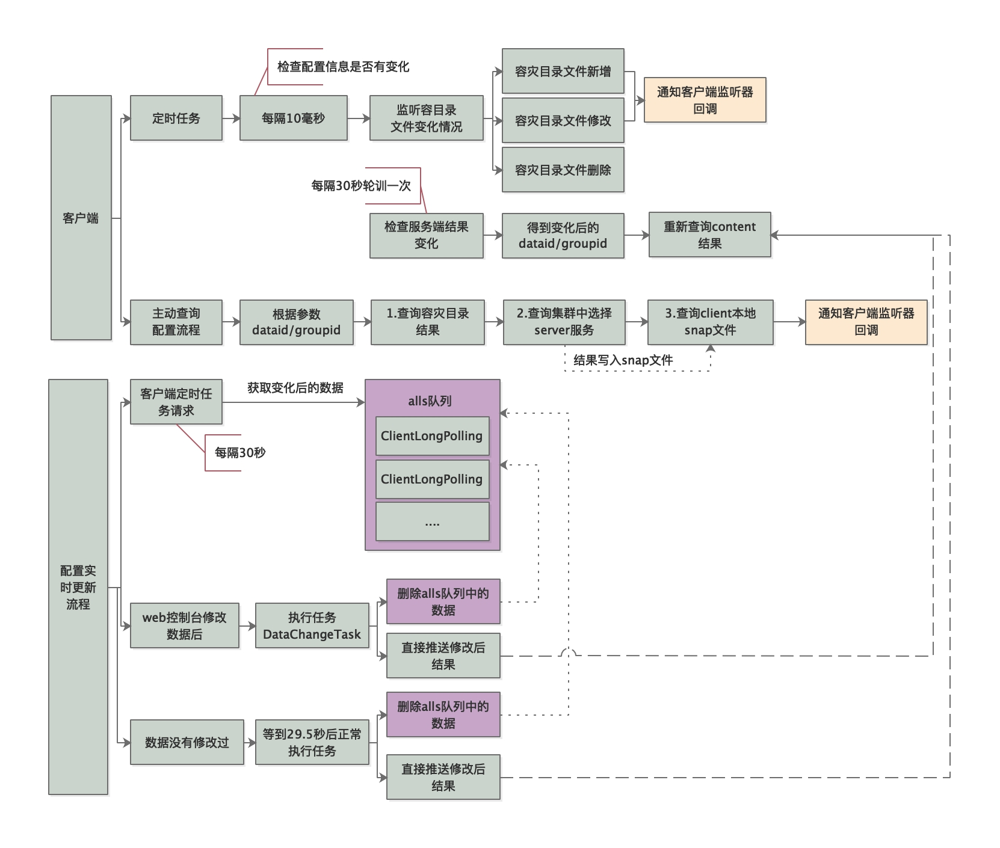

# 1.实时更新流程



# 2.客户端操作

每次都靠客户端去发请求，询问服务端我所关注的配置项有没有发生变更，那请求的间隔改设置为多少才合适呢？

如果间隔时间设置的太长的话有可能无法及时获取服务端的变更，如果间隔时间设置的太短的话，那么频繁的请求对于服务端来说无疑也是一种负担。

**所以最好的方式是客户端每隔一段长度适中的时间去服务端请求，而在这期间如果配置发生变更，服务端能够主动将变更后的结果推送给客户端，这样既能保证客户端能够实时感知到配置的变化，也降低了服务端的压力。**

## 2.1.客户端长轮询

```java
class LongPollingRunnable implements Runnable {
  private int taskId;

  public LongPollingRunnable(int taskId) {
    this.taskId = taskId;
  }

  @Override
  public void run() {

    List<CacheData> cacheDatas = new ArrayList<CacheData>();
    List<String> inInitializingCacheList = new ArrayList<String>();
    try {
      // check failover config
      for (CacheData cacheData : cacheMap.get().values()) {
        if (cacheData.getTaskId() == taskId) {
          cacheDatas.add(cacheData);
          try {
            //检查容灾目录配置的文件是否有变化（新增、修改、删除）
            checkLocalConfig(cacheData);
            if (cacheData.isUseLocalConfigInfo()) {
              //其中（新增和修改是需要回调客户端监听器的）
              cacheData.checkListenerMd5();
            }
          } catch (Exception e) {
          
          }
        }
      }
      //检查服务端数据是否有变化
      List<String> changedGroupKeys = checkUpdateDataIds(cacheDatas, inInitializingCacheList);

      for (String groupKey : changedGroupKeys) {
        String[] key = GroupKey.parseKey(groupKey);
        String dataId = key[0];
        String group = key[1];
        String tenant = null;
        if (key.length == 3) {
          tenant = key[2];
        }
        try {
          //每个变化后的数据从服务端获取数据，通过dataid和groupid
          String content = getServerConfig(dataId, group, tenant, 3000L);
          CacheData cache = cacheMap.get().get(GroupKey.getKeyTenant(dataId, group, tenant));
          cache.setContent(content);
         
        } catch (NacosException ioe) {
          
        }
      }
      for (CacheData cacheData : cacheDatas) {
        if (!cacheData.isInitializing() || inInitializingCacheList
            .contains(GroupKey.getKeyTenant(cacheData.dataId, cacheData.group, cacheData.tenant))) {
          //回调监听器
          cacheData.checkListenerMd5();
        }
      }

      executorService.execute(this);

    } catch (Throwable e) {

    }
  }
}
```

## 2.2.Server获取值变化了的DataID列表

```java
List<String> checkUpdateConfigStr(String probeUpdateString, boolean isInitializingCacheList) throws IOException {

  List<String> params = Arrays.asList(Constants.PROBE_MODIFY_REQUEST, probeUpdateString);

  List<String> headers = new ArrayList<String>(2);

  headers.add("Long-Pulling-Timeout");
  headers.add("" + timeout);

  // told server do not hang me up if new initializing cacheData added in
  if (isInitializingCacheList) {
    headers.add("Long-Pulling-Timeout-No-Hangup");
    headers.add("true");
  }
	...
    //timeout http超时时间 ,请求服务端数据
    HttpResult result = agent.httpPost(Constants.CONFIG_CONTROLLER_PATH + "/listener", headers, params,
                                       agent.getEncode(), timeout);
  }
  return Collections.emptyList();
}
```

# 3.服务端操作

## 3.1.server提供的http服务

比较md5值

```java
@PostMapping("/listener")
public void listener(HttpServletRequest request, HttpServletResponse response)
  throws ServletException, IOException {
  request.setAttribute("org.apache.catalina.ASYNC_SUPPORTED", true);
  String probeModify = request.getParameter("Listening-Configs");

  probeModify = URLDecoder.decode(probeModify, Constants.ENCODE);

  Map<String, String> clientMd5Map;
  try {
    //解析client传入的参数
    clientMd5Map = MD5Util.getClientMd5Map(probeModify);
  } catch (Throwable e) {
   
  }
  // do long-polling  //长轮询操作
  inner.doPollingConfig(request, response, clientMd5Map, probeModify.length());
}
```

```java
public String doPollingConfig(HttpServletRequest request, HttpServletResponse response,
                              Map<String, String> clientMd5Map, int probeRequestSize)
  throws IOException {

  // 长轮询 ,加入ClientLongPolling到alls队列
  if (LongPollingService.isSupportLongPolling(request)) {
    longPollingService.addLongPollingClient(request, response, clientMd5Map, probeRequestSize);
    return HttpServletResponse.SC_OK + "";
  }
}
```

## 3.2.ClientLongPolling

```java
class ClientLongPolling implements Runnable {

  @Override
  public void run() {
    //正常任务执行逻辑（数据没有修改的情况下），每隔29.5秒检查一次
    asyncTimeoutFuture = scheduler.schedule(new Runnable() {
      @Override
      public void run() {
        try {
          /**
            * 删除订阅关系
            */               
          allSubs.remove(ClientLongPolling.this);

          if (isFixedPolling()) {
            //得到变化后到数据
            List<String> changedGroups = MD5Util.compareMd5(
              (HttpServletRequest)asyncContext.getRequest(),
              (HttpServletResponse)asyncContext.getResponse(), clientMd5Map);
            if (changedGroups.size() > 0) {
              //发送结果
              sendResponse(changedGroups);
            } else {
              sendResponse(null);
            }
          } 

      }

    }, timeoutTime, TimeUnit.MILLISECONDS);
		//队列加入定时任务
    allSubs.add(this);
  }

  void sendResponse(List<String> changedGroups) {
    /**
      *  取消超时任务
      */
    if (null != asyncTimeoutFuture) {
      asyncTimeoutFuture.cancel(false);
    }
    generateResponse(changedGroups);
  }
```

## 3.3.数据变更逻辑

```java
ConfigController.java//
  @PostMapping
  public Boolean publishConfig(){
  persistService.insertOrUpdate(srcIp, srcUser, configInfo, time, configAdvanceInfo, false);
  //发布事件
  EventDispatcher.fireEvent(new ConfigDataChangeEvent(false, dataId, group, tenant, time.getTime()));
}  

```

### 3.3.1.通知集群中其他服务器

```java
class AsyncTask implements Runnable {
  private void executeAsyncInvoke() {
    while (!queue.isEmpty()) {
      NotifySingleTask task = queue.poll();
      String targetIp = task.getTargetIP();
      if (serverListService.getServerList().contains(
        targetIp)) {
        // 启动健康检查且有不监控的ip则直接把放到通知队列，否则通知
        if (serverListService.isHealthCheck()
            && ServerListService.getServerListUnhealth().contains(targetIp)) {
          // target ip 不健康，则放入通知列表中
          ConfigTraceService.logNotifyEvent(task.getDataId(), task.getGroup(), task.getTenant(), null,
                                            task.getLastModified(),
                                            LOCAL_IP, ConfigTraceService.NOTIFY_EVENT_UNHEALTH, 0, task.target);
          // get delay time and set fail count to the task
          asyncTaskExecute(task);
        } else {
          HttpGet request = new HttpGet(task.url);
          request.setHeader(NotifyService.NOTIFY_HEADER_LAST_MODIFIED,
                            String.valueOf(task.getLastModified()));
          request.setHeader(NotifyService.NOTIFY_HEADER_OP_HANDLE_IP, LOCAL_IP);
          if (task.isBeta) {
            request.setHeader("isBeta", "true");
          }
          httpclient.execute(request, new AsyncNotifyCallBack(httpclient, task));
        }
      }
    }
  }
}
```


### 3.3.2.通知调用客户端

```java
class DataChangeTask implements Runnable {
  @Override
  public void run() {
    try {
      ...
      //遍历队列中所有ClientLongPolling，如果groupKey相等则进行通知操作
      for (Iterator<ClientLongPolling> iter = allSubs.iterator(); iter.hasNext(); ) {
        ClientLongPolling clientSub = iter.next();
        if (clientSub.clientMd5Map.containsKey(groupKey)) {
          ...
          iter.remove(); // 删除订阅关系
          //返回结果给调用客户端
          clientSub.sendResponse(Arrays.asList(groupKey));
        }
      }
    } catch (Throwable t) {
     
    }
  }
```

# 4.结论

- 1.Nacos 客户端会循环请求服务端变更的数据，并且超时时间设置为30s，当配置发生变化时，请求的响应会立即返回，否则会一直等到 29.5s+ 之后再返回响应
- 2.Nacos 客户端能够实时感知到服务端配置发生了变化。
- 3.实时感知是建立在客户端拉和服务端“推”的基础上，但是这里的服务端“推”需要打上引号，因为服务端和客户端直接本质上还是通过 http 进行数据通讯的，之所以有“推”的感觉，是因为服务端主动将变更后的数据通过 http 的 response 对象提前写入了。

