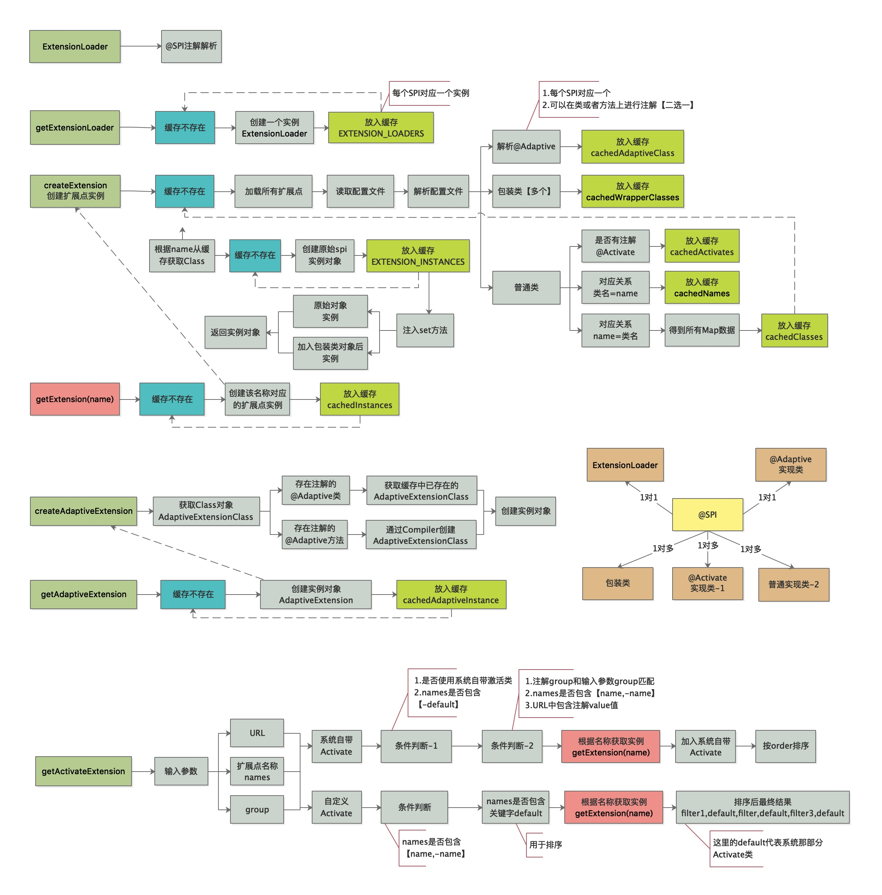
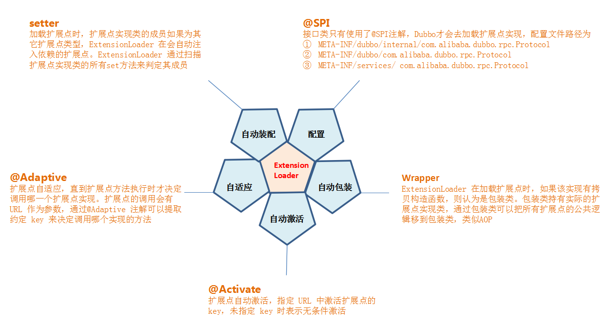

# 1.调用流程图



# 2.ExtensionLoader组成部分



# 3.源码分析

**测试程序**

```java
public static void main(String[] args) {
  ExtensionLoader<Protocol> loader = ExtensionLoader.getExtensionLoader(Protocol.class);
  Protocol protocol = loader.getExtension("registry");
  System.out.println(protocol.getClass());

  Protocol autowireProtocol = loader.getAdaptiveExtension();
  System.out.println(autowireProtocol.getClass());

}
```

## 3.1.根据type获取ExtensionLoader

>1. 判断是否为null
>
>2. 判断是否是接口
>
>3. 判断接口是否有@SPI注解
>
>4. 创建新的ExtensionLoader

```java
public static <T> ExtensionLoader<T> getExtensionLoader(Class<T> type) {
  //判断是否为null
  if (type == null){
    ...
  }
  //判断是否是接口
  if (!type.isInterface()) {
    ...
  }
  //判断接口是否有@SPI注解
  if (!withExtensionAnnotation(type)) {
    ...
  }
  //从缓存获取
  ExtensionLoader<T> loader = (ExtensionLoader<T>) EXTENSION_LOADERS.get(type);
  if (loader == null) {
    //创建新的ExtensionLoader
    EXTENSION_LOADERS.putIfAbsent(type, new ExtensionLoader<T>(type));
    loader = (ExtensionLoader<T>) EXTENSION_LOADERS.get(type);
  }
  return loader;
}
```

## 3.2.创建ExtensionLoader实例

```java
private ExtensionLoader(Class<?> type) {
  this.type = type;
  //如果type 不等于 ExtensionFactory，则获取自适应Factory,主要用于实例化对象时，set方法的注入,来获取注入协议的自适应AdaptiveExtension实例
  //例如：RegistryProtocol中的set方法 : setProtocol、setCluster、setRegistryFactory等
  objectFactory = (type == ExtensionFactory.class ? null :                ExtensionLoader.getExtensionLoader(ExtensionFactory.class).getAdaptiveExtension());
}
```

## 3.3.根据name获取真实对象实例

```java
public T getExtension(String name) {
  ...
  //如果name=true，则返回默认值
  if ("true".equals(name)) {
    return getDefaultExtension();
  }
  Holder<Object> holder = cachedInstances.get(name);
  if (holder == null) {
    cachedInstances.putIfAbsent(name, new Holder<Object>());
    holder = cachedInstances.get(name);
  }
  Object instance = holder.get();
  //缓存为null
  if (instance == null) {
    synchronized (holder) {
      instance = holder.get();
      if (instance == null) {
        instance = createExtension(name);
        holder.set(instance);
      }
    }
  }
  return (T) instance;
}
```

**1.getExtensionClasses方法执行过程**

```java
private Map<String, Class<?>> getExtensionClasses() {
  Map<String, Class<?>> classes = cachedClasses.get();
  if (classes == null) {
    synchronized (cachedClasses) {
      classes = cachedClasses.get();
      //缓存为null
      if (classes == null) {
        classes = loadExtensionClasses();
        cachedClasses.set(classes);
      }
    }
  }
  return classes;
}
```

**2.loadClass方法执行过程**

>1. 如果该实现类中有@Adaptive注解，只能有一个
>
>2. 如果是包装类，主要用于类似于AOP，可以有多个
>3. 普通实现类处理，主要处理@Activate自动激活类和普通实现类

```java
private void loadClass(Map<String, Class<?>> extensionClasses, java.net.URL resourceURL, Class<?> clazz, String name) throws NoSuchMethodException {
  //如果该实现类中有@Adaptive注解，只能有一个
  if (clazz.isAnnotationPresent(Adaptive.class)) {
    if (cachedAdaptiveClass == null) {
      cachedAdaptiveClass = clazz;
    } else if (!cachedAdaptiveClass.equals(clazz)) {
      throw new IllegalStateException("More than 1 adaptive class found: "
                                      + cachedAdaptiveClass.getClass().getName()
                                      + ", " + clazz.getClass().getName());
    }
  }
  //如果是包装类，主要用于类似于AOP，可以有多个
  else if (isWrapperClass(clazz)) {
    Set<Class<?>> wrappers = cachedWrapperClasses;
    if (wrappers == null) {
      cachedWrapperClasses = new ConcurrentHashSet<Class<?>>();
      wrappers = cachedWrapperClasses;
    }
    wrappers.add(clazz);
  }
  //普通实现类处理，主要处理@Activate自动激活类和普通实现类
  else {
    clazz.getConstructor();
    if (name == null || name.length() == 0) {
      name = findAnnotationName(clazz);
    }
    String[] names = NAME_SEPARATOR.split(name);
    if (names != null && names.length > 0) {
      Activate activate = clazz.getAnnotation(Activate.class);
      if (activate != null) {
        cachedActivates.put(names[0], activate);
      }
      for (String n : names) {
        if (!cachedNames.containsKey(clazz)) {
          cachedNames.put(clazz, n);
        }
        Class<?> c = extensionClasses.get(n);
        if (c == null) {
          //加入缓存
          extensionClasses.put(n, clazz);
        } 
      }
    }
  }
}

//判断是否是包装类，构造方法
private boolean isWrapperClass(Class<?> clazz) {
  try {
    clazz.getConstructor(type);
    return true;
  } catch (NoSuchMethodException e) {
    return false;
  }
}
```

**3.createExtension(String name)创建实例过程**

```java
private T createExtension(String name) {
  //根据缓存中查询该name对应的Class对象
  Class<?> clazz = getExtensionClasses().get(name);
  if (clazz == null) {
    throw findException(name);
  }
  try {
    T instance = (T) EXTENSION_INSTANCES.get(clazz);
    if (instance == null) {
      //实例化对象instance
      EXTENSION_INSTANCES.putIfAbsent(clazz, clazz.newInstance());
      instance = (T) EXTENSION_INSTANCES.get(clazz);
    }
    //instance对象注入属性，类似于IOC
    injectExtension(instance);
    Set<Class<?>> wrapperClasses = cachedWrapperClasses;
    //加入包装类
    if (wrapperClasses != null && !wrapperClasses.isEmpty()) {
      for (Class<?> wrapperClass : wrapperClasses) {
        //通过构造方法实例化对象
        instance = injectExtension((T) wrapperClass.getConstructor(type).newInstance(instance));
      }
    }
    return instance;
  } catch (Throwable t) {
    ...
  }
}
```

**4.injectExtension注入对象属性过程**

```java
private T injectExtension(T instance) {
  try {
    if (objectFactory != null) {
      for (Method method : instance.getClass().getMethods()) {
        //set方法判断逻辑
        if (method.getName().startsWith("set")
            && method.getParameterTypes().length == 1
            && Modifier.isPublic(method.getModifiers())) {
          if (method.getAnnotation(DisableInject.class) != null) {
            continue;
          }
          Class<?> pt = method.getParameterTypes()[0];
          try {
            String property = method.getName().length() > 3 ? method.getName().substring(3, 4).toLowerCase() + method.getName().substring(4) : "";
            //获取注入对象 [objectFactory = SpiExtensionFactory]
            Object object = objectFactory.getExtension(pt, property);
            if (object != null) {
              //执行注入动作
              method.invoke(instance, object);
            }
          } catch (Exception e) {
            ...
          }
        }
      }
    }
  } catch (Exception e) {
    ...
  }
  return instance;
}
```

## 3.4.获取SPI接口类型的自适应实例对象

```java
public T getAdaptiveExtension() {
  Object instance = cachedAdaptiveInstance.get();
  if (instance == null) {
    if (createAdaptiveInstanceError == null) {
      synchronized (cachedAdaptiveInstance) {
        instance = cachedAdaptiveInstance.get();
        if (instance == null) {
          try {
            //创建
            instance = createAdaptiveExtension();
            cachedAdaptiveInstance.set(instance);
          } catch (Throwable t) {
            createAdaptiveInstanceError = t;
            throw new IllegalStateException("fail to create adaptive instance: " + t.toString(), t);
          }
        }
      }
    } else {
      ...
    }
  }

  return (T) instance;
}
```

**1.createAdaptiveExtension创建自适应对象**

```java
private T createAdaptiveExtension() {
  try {
    //实例化对象
    return injectExtension((T) getAdaptiveExtensionClass().newInstance());
  } catch (Exception e) {
    ...
  }
}

private Class<?> getAdaptiveExtensionClass() {
  getExtensionClasses();
  //缓存中是否存在AdaptiveClass
  if (cachedAdaptiveClass != null) {
    return cachedAdaptiveClass;
  }
  return cachedAdaptiveClass = createAdaptiveExtensionClass();
}

private Class<?> createAdaptiveExtensionClass() {
  //得到创建code
  String code = createAdaptiveExtensionClassCode();
  ClassLoader classLoader = findClassLoader();
  com.alibaba.dubbo.common.compiler.Compiler compiler = ExtensionLoader.getExtensionLoader(com.alibaba.dubbo.common.compiler.Compiler.class).getAdaptiveExtension();
  return compiler.compile(code, classLoader);
}
```

