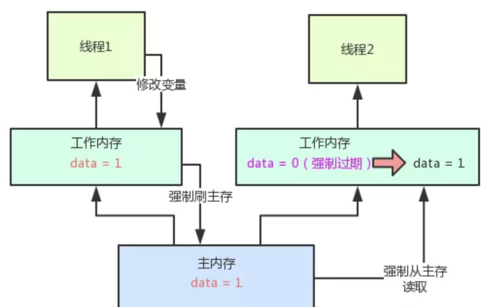

# 1.可见性

对一个变量加了volatile关键字修饰之后，只要一个线程修改了这个变量的值，立马强制刷回主内存。

接着强制过期其他线程的本地工作内存中的缓存，最后其他线程读取变量值的时候，强制重新从主内存来加载最新的值！

这样就保证，任何一个线程修改了变量值，其他线程立马就可以看见了！



# 2.有序性(禁止指令重排优化)

先了解一个概念，内存屏障(Memory Barrier）。
内存屏障，又称内存栅栏，是一个CPU指令，它的作用有两个，一是保证特定操作的执行顺序，二是保证某些变量的内存可见性（利用该特性实现volatile的内存可见性）。由于编译器和处理器都能执行指令重排优化。如果在指令间插入一条Memory Barrier则会告诉编译器和CPU，不管什么指令都不能和这条Memory Barrier指令重排序，也就是说通过插入内存屏障禁止在内存屏障前后的指令执行重排序优化。

Memory Barrier的另外一个作用是强制刷出各种CPU的缓存数据，因此任何CPU上的线程都能读取到这些数据的最新版本。

总之，volatile变量正是通过内存屏障实现其在内存中的语义，即可见性和禁止重排优化。下面看一个非常典型的禁止重排优化的例子DCL，如下：

```java
public class DoubleCheckLock {
    private static DoubleCheckLock instance;
    private DoubleCheckLock(){}
    public static DoubleCheckLock getInstance(){
        //第一次检测
        if (instance==null){
            //同步
            synchronized (DoubleCheckLock.class){
                if (instance == null){
                    //多线程环境下可能会出现问题的地方
                    instance = new DoubleCheckLock();
                }
            }
        }
        return instance;
    }
}
```

**正常逻辑**

```java
memory = allocate(); //1.分配对象内存空间
instance(memory);    //2.初始化对象
instance = memory;   //3.设置instance指向刚分配的内存地址，此时instance！=null
```

由于步骤2和步骤3不存在数据依赖关系，而且无论重排前还是重排后程序的执行结果在单线程中并没有改变，因此这种重排优化是允许的。

**异常逻辑**

```java
memory = allocate(); //1.分配对象内存空间
instance = memory;   //3.设置instance指向刚分配的内存地址,此时instance!=null,但对象还没有初始化完成！
instance(memory);    //2.初始化对象
```

所以当一条线程访问instance不为null时，由于instance实例未必已初始化完成，也就造成了线程安全问题。那么该如何解决呢，很简单，我们使用volatile禁止instance变量被执行指令重排优化即可。

 ```java
//禁止指令重排优化
private volatile static DoubleCheckLock instance;
 ```

# 3.原子性

但是如果是多个线程同时修改一个变量的值，那还是可能出现多线程并发的安全问题，导致数据值修改错乱，volatile是不负责解决这个问题的，也就是不负责解决原子性问题！

原子性问题，得依赖synchronized、ReentrantLock等加锁机制来解决。