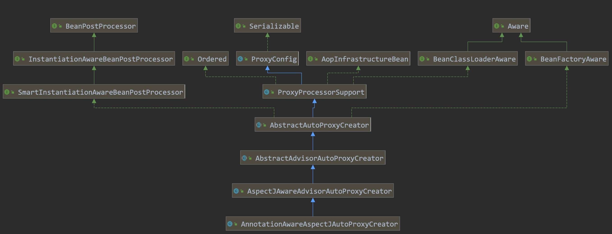
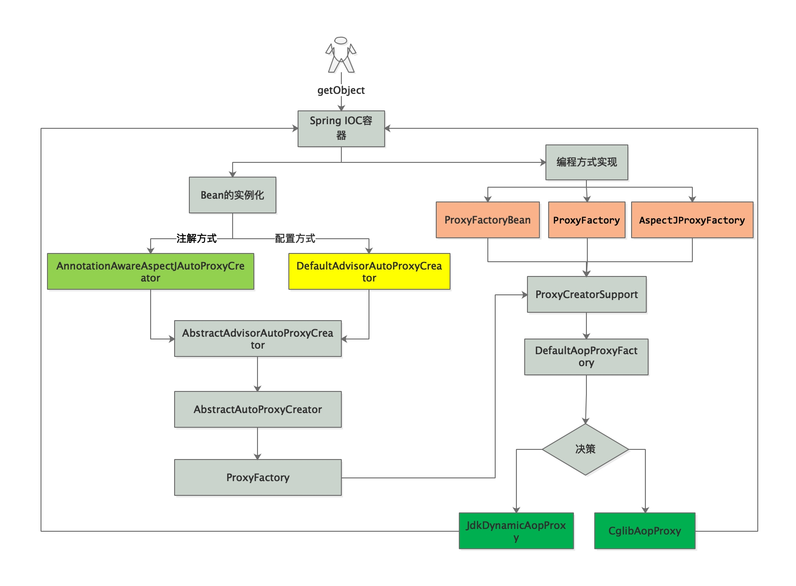
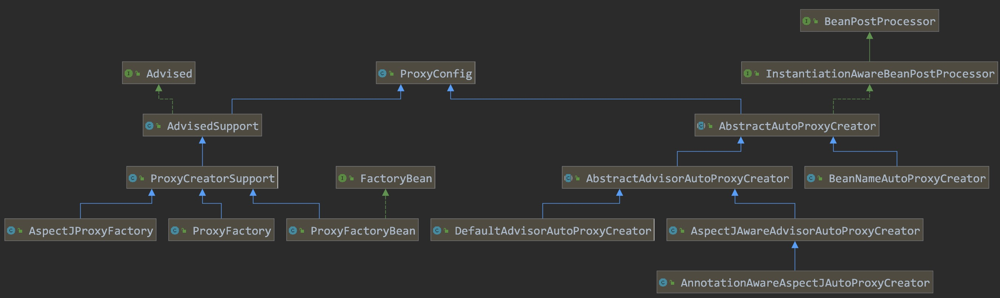

# 1.AOP执行流程


# 2.@EnableAspectJAutoProxy处理

```java
public void registerBeanDefinitions(
  AnnotationMetadata importingClassMetadata, BeanDefinitionRegistry registry) {
  //这里注册AnnotationAwareAspectJAutoProxyCreator.class处理类
  AopConfigUtils.registerAspectJAnnotationAutoProxyCreatorIfNecessary(registry);

  AnnotationAttributes enableAspectJAutoProxy =
    AnnotationConfigUtils.attributesFor(importingClassMetadata, EnableAspectJAutoProxy.class);
  if (enableAspectJAutoProxy != null) {
    //jdk动态代理 = false  cglib动态代理 = true (默认为false)
    if (enableAspectJAutoProxy.getBoolean("proxyTargetClass")) {
      AopConfigUtils.forceAutoProxyCreatorToUseClassProxying(registry);
    }
    // 执行targer方法时，内部方法是否需要代理 (默认为false)
    if (enableAspectJAutoProxy.getBoolean("exposeProxy")) {
      AopConfigUtils.forceAutoProxyCreatorToExposeProxy(registry);
    }
  }
}
```

## 2.1. AnnotationAwareAspectJAutoProxyCreator类结构图



# 3.bean实例化之前过程

* AbstractAutoProxyCreator#postProcessBeforeInstantiation

```java
public Object postProcessBeforeInstantiation(Class<?> beanClass, String beanName) {
  Object cacheKey = getCacheKey(beanClass, beanName);
  if (!StringUtils.hasLength(beanName) || !this.targetSourcedBeans.contains(beanName)) {
    ...
      // 是否结构化  //是否需要跳过
      if (isInfrastructureClass(beanClass) || shouldSkip(beanClass, beanName)) {
        this.advisedBeans.put(cacheKey, Boolean.FALSE);
        return null;
      }
  }
  ...
    return null;
}
```

## 3.1. 判断是否是基础类

* AnnotationAwareAspectJAutoProxyCreator#isInfrastructureClass

```java
protected boolean isInfrastructureClass(Class<?> beanClass) {
  boolean retVal = Advice.class.isAssignableFrom(beanClass) ||
    Pointcut.class.isAssignableFrom(beanClass) ||
      Advisor.class.isAssignableFrom(beanClass) ||
        AopInfrastructureBean.class.isAssignableFrom(beanClass);
  return retVal;
}

protected boolean isInfrastructureClass(Class<?> beanClass) {
  return (super.isInfrastructureClass(beanClass) ||
          (this.aspectJAdvisorFactory != null && this.aspectJAdvisorFactory.isAspect(beanClass)));//class是否有@Aspect注解
}
```

## 3.2. 判断是否跳过bean

* AspectJAwareAdvisorAutoProxyCreator#shouldSkip

```java
protected boolean shouldSkip(Class<?> beanClass, String beanName) {
  // TODO: Consider optimization by caching the list of the aspect names
  List<Advisor> candidateAdvisors = findCandidateAdvisors();
  ...
  return super.shouldSkip(beanClass, beanName);
}
public List<Advisor> findAdvisorBeans() {
  // Determine list of advisor bean names, if not cached already.
  String[] advisorNames = this.cachedAdvisorBeanNames;
  if (advisorNames == null) {
    //查找所有的 Advisor
    advisorNames = BeanFactoryUtils.beanNamesForTypeIncludingAncestors(
      this.beanFactory, Advisor.class, true, false);
    this.cachedAdvisorBeanNames = advisorNames;
  }
  if (advisorNames.length == 0) {
    return new ArrayList<>();
  }
  ...
  return advisors;
}
```

## 3.3. 构建AspectJ Advisor

>**调用链路**
>
>BeanFactoryAspectJAdvisorsBuilder.buildAspectJAdvisors
>
>* ReflectiveAspectJAdvisorFactory.getAdvisors
>  * ReflectiveAspectJAdvisorFactory.getAdvisor
>    * new InstantiationModelAwarePointcutAdvisorImpl()
>      * InstantiationModelAwarePointcutAdvisorImpl.instantiateAdvice
>        * ReflectiveAspectJAdvisorFactory.getAdvice

* BeanFactoryAspectJAdvisorsBuilder#buildAspectJAdvisors

```java
String[] beanNames = BeanFactoryUtils.beanNamesForTypeIncludingAncestors(
this.beanFactory, Object.class, true, false);
for (String beanName : beanNames) {
  if (!isEligibleBean(beanName)) {
    continue;
  }
  // We must be careful not to instantiate beans eagerly as in this case they
  // would be cached by the Spring container but would not have been weaved.
  Class<?> beanType = this.beanFactory.getType(beanName);
  if (beanType == null) {
    continue;
  }
//如果该类有@AspectJ注解
if (this.advisorFactory.isAspect(beanType)) {
  aspectNames.add(beanName);
  AspectMetadata amd = new AspectMetadata(beanType, beanName);
  if (amd.getAjType().getPerClause().getKind() == PerClauseKind.SINGLETON) {
    MetadataAwareAspectInstanceFactory factory =
      new BeanFactoryAspectInstanceFactory(this.beanFactory, beanName);
    //查找该类对应Advisor
    List<Advisor> classAdvisors = this.advisorFactory.getAdvisors(factory);
    if (this.beanFactory.isSingleton(beanName)) {
      this.advisorsCache.put(beanName, classAdvisors);
    }
    else {
      this.aspectFactoryCache.put(beanName, factory);
    }
    advisors.addAll(classAdvisors);
  }
}
...
```

```java
public List<Advisor> getAdvisors(MetadataAwareAspectInstanceFactory aspectInstanceFactory) {
  Class<?> aspectClass = aspectInstanceFactory.getAspectMetadata().getAspectClass();
...
  List<Advisor> advisors = new ArrayList<>();
//查找AdvisorMethods 方法
  for (Method method : getAdvisorMethods(aspectClass)) {
    Advisor advisor = getAdvisor(method, lazySingletonAspectInstanceFactory, advisors.size(), aspectName);
    if (advisor != null) {
      advisors.add(advisor);
    }
  }
...
  return advisors;
}
```

* ReflectiveAspectJAdvisorFactory#getAdvisorMethods

```java
static {
  Comparator<Method> adviceKindComparator = new ConvertingComparator<>(
    new InstanceComparator<>(
      //🚩第一次排序
      Around.class, Before.class, After.class, AfterReturning.class, AfterThrowing.class),
    (Converter<Method, Annotation>) method -> {
      AspectJAnnotation<?> annotation =
        AbstractAspectJAdvisorFactory.findAspectJAnnotationOnMethod(method);
      return (annotation != null ? annotation.getAnnotation() : null);
    });
  Comparator<Method> methodNameComparator = new ConvertingComparator<>(Method::getName);
  METHOD_COMPARATOR = adviceKindComparator.thenComparing(methodNameComparator);
}
private List<Method> getAdvisorMethods(Class<?> aspectClass) {
  final List<Method> methods = new ArrayList<>();
  ReflectionUtils.doWithMethods(aspectClass, method -> {
    // 排出 pointcuts 注解
    if (AnnotationUtils.getAnnotation(method, Pointcut.class) == null) {
      methods.add(method);
    }
  });
  //排序
  methods.sort(METHOD_COMPARATOR);
  return methods;
}
```

* ReflectiveAspectJAdvisorFactory#getAdvisor

```java
public Advisor getAdvisor(Method candidateAdviceMethod, MetadataAwareAspectInstanceFactory aspectInstanceFactory,int declarationOrderInAspect, String aspectName) {
 ...
 //表达式
  AspectJExpressionPointcut expressionPointcut = getPointcut(
    candidateAdviceMethod, aspectInstanceFactory.getAspectMetadata().getAspectClass());
  if (expressionPointcut == null) {
    return null;
  }
//返回包装过后的advisor
return new InstantiationModelAwarePointcutAdvisorImpl(expressionPointcut, candidateAdviceMethod,this, aspectInstanceFactory, declarationOrderInAspect, aspectName);
}
```

# 4.bean初始化之后过程

* AbstractAutoProxyCreator#wrapIfNecessary

```java 
protected Object wrapIfNecessary(Object bean, String beanName, Object cacheKey) {
  ...
    if (isInfrastructureClass(bean.getClass()) || shouldSkip(bean.getClass(), beanName)) {
      this.advisedBeans.put(cacheKey, Boolean.FALSE);
      return bean;
    }
  //获取该bean对应的特定拦截器
  Object[] specificInterceptors = getAdvicesAndAdvisorsForBean(bean.getClass(), beanName, null);
  //如果有特定拦截器,则需要创建代理对象
  if (specificInterceptors != DO_NOT_PROXY) {
    this.advisedBeans.put(cacheKey, Boolean.TRUE);
    //创建代理对象
    Object proxy = createProxy(
      bean.getClass(), beanName, specificInterceptors, new SingletonTargetSource(bean));
    this.proxyTypes.put(cacheKey, proxy.getClass());
    return proxy;
  }
  ...
    return bean;
}
```

* AbstractAdvisorAutoProxyCreator#findEligibleAdvisors

```java
protected List<Advisor> findEligibleAdvisors(Class<?> beanClass, String beanName) {
  //获取缓存中存在的Advisor
  List<Advisor> candidateAdvisors = findCandidateAdvisors();
  //找到符合该bean所对应的Advisor
  List<Advisor> eligibleAdvisors = findAdvisorsThatCanApply(candidateAdvisors, beanClass, beanName);
  //增强advisor
  extendAdvisors(eligibleAdvisors);
  if (!eligibleAdvisors.isEmpty()) {
    //advisor 排序
    eligibleAdvisors = sortAdvisors(eligibleAdvisors);
  }
  return eligibleAdvisors;
}
```

* AopUtils#canApply

```java
public static boolean canApply(Pointcut pc, Class<?> targetClass, boolean hasIntroductions) {
  //类织入
  if (!pc.getClassFilter().matches(targetClass)) {
    return false;
  }
  ...
  Set<Class<?>> classes = new LinkedHashSet<>();
  if (!Proxy.isProxyClass(targetClass)) {
    classes.add(ClassUtils.getUserClass(targetClass));
  }
  classes.addAll(ClassUtils.getAllInterfacesForClassAsSet(targetClass));
 //判断targetClass 是否有符合条件的Advisor
  for (Class<?> clazz : classes) {
    Method[] methods = ReflectionUtils.getAllDeclaredMethods(clazz);
    for (Method method : methods) {
      if (introductionAwareMethodMatcher != null ?
          introductionAwareMethodMatcher.matches(method, targetClass, hasIntroductions) :
          methodMatcher.matches(method, targetClass)) {
        return true;
      }
    }
  }
  return false;
}
```

* AspectJAwareAdvisorAutoProxyCreator#sortAdvisors

>**排序过程调用链路**
>
>* AspectJAwareAdvisorAutoProxyCreator.sortAdvisors
>  * PartialOrder.sort
>    * PartialOrder.addNewPartialComparable
>      * PartialOrder.addDirectedLinks
>        * AspectJPrecedenceComparator.compare
>          * AspectJPrecedenceComparator.comparePrecedenceWithinAspect

```java
protected List<Advisor> sortAdvisors(List<Advisor> advisors) {
  List<PartiallyComparableAdvisorHolder> partiallyComparableAdvisors = new ArrayList<>(advisors.size());
  for (Advisor element : advisors) {
    partiallyComparableAdvisors.add(
      new PartiallyComparableAdvisorHolder(element, DEFAULT_PRECEDENCE_COMPARATOR));
  }
  //排序
  List<PartiallyComparableAdvisorHolder> sorted = PartialOrder.sort(partiallyComparableAdvisors);
...
}
```

```java 
public int compare(Advisor o1, Advisor o2) {
  int advisorPrecedence = this.advisorComparator.compare(o1, o2);
  if (advisorPrecedence == SAME_PRECEDENCE && declaredInSameAspect(o1, o2)) {
    advisorPrecedence = comparePrecedenceWithinAspect(o1, o2);
  }
  return advisorPrecedence;
}

//🚩如果order相等的情况下，值越小优先级越高
private int comparePrecedenceWithinAspect(Advisor advisor1, Advisor advisor2) {
  boolean oneOrOtherIsAfterAdvice =
    (AspectJAopUtils.isAfterAdvice(advisor1) || AspectJAopUtils.isAfterAdvice(advisor2));
  int adviceDeclarationOrderDelta = getAspectDeclarationOrder(advisor1) - getAspectDeclarationOrder(advisor2);

  //🚩首先判断是否是AfterAdvice，如果是AfterAdvice，则值越小优先级越高
  if (oneOrOtherIsAfterAdvice) {
    if (adviceDeclarationOrderDelta < 0) {
      return LOWER_PRECEDENCE;
    }
    else if (adviceDeclarationOrderDelta == 0) {
      return SAME_PRECEDENCE;
    }
    else {
      return HIGHER_PRECEDENCE;
    }
  }
  //🚩如果不是AfterAdvice，则值越大优先级越高
  else {
    if (adviceDeclarationOrderDelta < 0) {
      return HIGHER_PRECEDENCE;
    }
    else if (adviceDeclarationOrderDelta == 0) {
      return SAME_PRECEDENCE;
    }
    else {
      return LOWER_PRECEDENCE;
    }
  }
}
```

# 5.创建bean代理过程

* AbstractAutoProxyCreator#createProxy

```java
protected Object createProxy(Class<?> beanClass, @Nullable String beanName,
 @Nullable Object[] specificInterceptors, TargetSource targetSource) {
...
  ProxyFactory proxyFactory = new ProxyFactory();
  proxyFactory.copyFrom(this);

  if (!proxyFactory.isProxyTargetClass()) {
    if (shouldProxyTargetClass(beanClass, beanName)) {
      //cglib代理
      proxyFactory.setProxyTargetClass(true);
    }
    else {
      evaluateProxyInterfaces(beanClass, proxyFactory);
    }
  }

  Advisor[] advisors = buildAdvisors(beanName, specificInterceptors);
  proxyFactory.addAdvisors(advisors);
  proxyFactory.setTargetSource(targetSource);
...
  return proxyFactory.getProxy(getProxyClassLoader());
}
```

* DefaultAopProxyFactory#createAopProxy

```java
public AopProxy createAopProxy(AdvisedSupport config) throws AopConfigException {
  if (config.isOptimize() || config.isProxyTargetClass() || hasNoUserSuppliedProxyInterfaces(config)) {
    Class<?> targetClass = config.getTargetClass();
 ...
    if (targetClass.isInterface() || Proxy.isProxyClass(targetClass)) {
      //jdk动态代理
      return new JdkDynamicAopProxy(config);
    }
    //cglib动态代理
    return new ObjenesisCglibAopProxy(config);
  }
  else {
    //jdk动态代理
    return new JdkDynamicAopProxy(config);
  }
}
```

## 5.1.获取beanproxy流程



## 5.2.Prxoy类结构图



# 6.拦截器执行invoke之前动作

* JdkDynamicAopProxy#invoke

```java
public Object invoke(Object proxy, Method method, Object[] args) throws Throwable {
  Object oldProxy = null;
  boolean setProxyContext = false;
  TargetSource targetSource = this.advised.targetSource;
  Object target = null;
  try {
    //处理equals方法
    if (!this.equalsDefined && AopUtils.isEqualsMethod(method)) {
      return equals(args[0]);
    }
    //处理hashcode方法
    else if (!this.hashCodeDefined && AopUtils.isHashCodeMethod(method)) {
      return hashCode();
    }
    ...
    Object retVal;
		//如果需要内部方法调用时也需要进行代理，则执行此动作
    if (this.advised.exposeProxy) {
      // Make invocation available if necessary.
      oldProxy = AopContext.setCurrentProxy(proxy);
      setProxyContext = true;
    }
    target = targetSource.getTarget();
    Class<?> targetClass = (target != null ? target.getClass() : null);

    //获取执行的拦截器链，同时将advisor转换为MethodInterceptor
    List<Object> chain = this.advised.getInterceptorsAndDynamicInterceptionAdvice(method, targetClass);
		//如果责任链为空，则直接执行目标方法
    if (chain.isEmpty()) {
      Object[] argsToUse = AopProxyUtils.adaptArgumentsIfNecessary(method, args);
      retVal = AopUtils.invokeJoinpointUsingReflection(target, method, argsToUse);
    }
    else {
      ...
     //执行拦截器链
      MethodInvocation invocation =
        new ReflectiveMethodInvocation(proxy, target, method, args, targetClass, chain);
      retVal = invocation.proceed();
    }
    return retVal;
  }
  finally {
   	...
    if (setProxyContext) {
      AopContext.setCurrentProxy(oldProxy);
    }
  }
}
```

## 6.1.设置内部方法之间的调用使用代理

```java
//如果需要内部方法调用时也需要进行代理，则执行此动作
if (this.advised.exposeProxy) {
  // Make invocation available if necessary.
  oldProxy = AopContext.setCurrentProxy(proxy);
  setProxyContext = true;
}
...
finally {
  ...
    if (setProxyContext) {
      AopContext.setCurrentProxy(oldProxy);
    }
}
//使用方式
class AppleServiceImpl implements AppleService{

  @Override
  public void a {
    System.out.println("测试a方法....");
  }
  @Override
  public void b() {
    //方法内部进行拦截，需要设置exposeProxy = true
    System.out.println("测试b方法....");
    ((AppleService)AopContext.currentProxy()).a();
  }

}
```


# 7.拦截方法执行invoke动作

* ReflectiveMethodInvocation#proceed【迭代执行MethodInterceptor链中的invoke方法]】

```java
public Object proceed() throws Throwable {
  //	We start with an index of -1 and increment early.
 if (this.currentInterceptorIndex == this.interceptorsAndDynamicMethodMatchers.size() - 1) {
    return invokeJoinpoint();
 }
  Object interceptorOrInterceptionAdvice =
    this.interceptorsAndDynamicMethodMatchers.get(++this.currentInterceptorIndex);
  ...
  //迭代执行拦截器链
  return ((MethodInterceptor) interceptorOrInterceptionAdvice).invoke(this);
}
```

* 执行顺序

```java
try {  
  try {  
    doAround();//对应@Around注解的方法切面逻辑 
    doBefore();//对应@Before注解的方法切面逻辑 
    method.invoke();  
    doAorund();//对应@Around注解的方法切面逻辑 
  } finally {  
    doAfter();//对应@After注解的方法切面逻辑
  }  
  doAfterReturning();//对应@AfterReturning注解的方法切面逻辑   
} catch(Exception e) {  
  doAfterThrowing();//对应@AfterThrowing注解的方法切面逻辑  
} 
```

# 8.用idea工具进行debug时踩坑记录

```java
public class StandardInvocationHandler implements InvocationHandler {
  private Object targer;
  public StandardInvocationHandler(Object targer) {
    this.targer = targer;
  }
  @Override
  public Object invoke(Object proxy, Method method, Object[] args) throws Throwable {
    System.out.println("调用方法：[" + method.getName() + "] 执行前");
    Object result = method.invoke(targer, args);
    System.out.println("调用方法：[" + method.getName() + "] 执行后");
    return result;
  }
}
```

```java
public class ApplicationJDKMain {

  public static void main(String[] args) {
    AppleService service = new AppleServiceImpl();
    InvocationHandler handler = new StandardInvocationHandler(service);
    AppleService proxyInstance = (AppleService) Proxy.newProxyInstance(AppleService.class.getClassLoader(), new Class[] { AppleService.class }, handler);
    proxyInstance.eatApple();
  }

}
```

**以上代码在用idea进行代码调试时，会出现以下现象**

>
>
>```java
>调用方法：[toString] 执行前
>调用方法：[toString] 执行后
>调用方法：[toString] 执行前
>调用方法：[toString] 执行后
>```

**不用debug模式，则不会出现这种情况**

------------

`这不是IDEA中的错误。如果在没有任何断点的情况下调试此方法，则可能会得到与预期相同的结果。但是如果你设置一些断点，IDEA将尝试调用toString（）方法,调试器都将重新评估范围内的每个变量（通过调用toString()）来刷新其值.`

参考：https://stackoverflow.com/questions/42972312/intellij-idea-debug-enter-method-multiple-times

